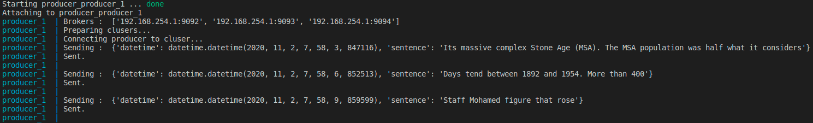
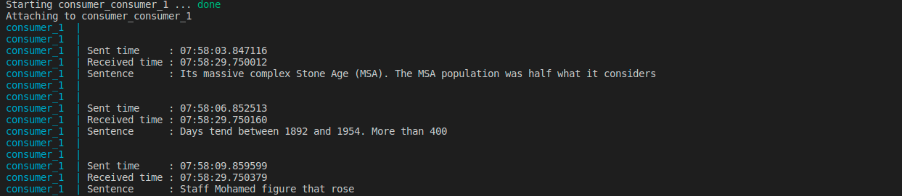
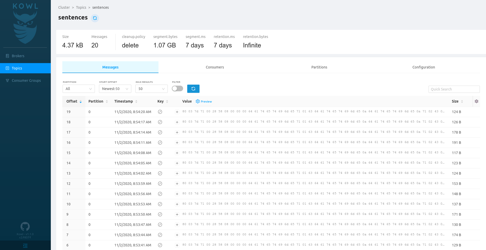

# Python Kafka Docker implementation

A simple implementation of a Kafka cluster (3 brokers) with 1 producer and 1 consumer, deployed with Docker.

This project includes :

- 1 Kafka cluster of 3 brokers
- 1 ZooKeeper cluster of 3 workers
- 1 Python example of producer
- 1 Python example of consumer

We won't use [Kafka Schema Registry](https://www.youtube.com/watch?v=5fjw62LGYNg) and Avro in this implementation. To maintain consistency among your data formats, I recommend you to directly use [DataClasses](https://realpython.com/python-data-classes/) if both your producers and consumers run with Python.

## 1. Configuration

First, you need to setup your cluster to be accessible from other containers on your computer. Get your Docker network interface IP or external IPv4 :

```bash
ip a | grep docker0
```


> In the image above, the IP to choose is `192.168.254.1`

Set it changing `YOUR_IP` inside `.env`, `producer/.env` and `consumer/.env`

> Interestingly, I was not able to make Kafka listen on `0.0.0.0` as it triggers an error. That's why we need to specify the exact IP of our machine.

## 2. Starting Kafka

Start the cluster :

```bash
docker-compose up -d
```

## 3. Adding and feeding a topic (producer)

Let's run our producer. It will push a random sentence in the `sentences` topic every 3 seconds.

```bash
docker-compose -f ./producer/docker-compose.yml up
```



## 4. Pulling messages (consumer)

Let's run our consumer. It will print messages when received :

```bash
docker-compose -f ./consumer/docker-compose.yml up
```



## 5. (optional) Watch the UI

Connect to [`localhost:8080`](http://localhost:8080) to visualize your cluster activity



## 6. TODOs for this repo

- [ ] Provide a fully working example of an SSL configuration
- [x] Provide an example on how to delete a topic
